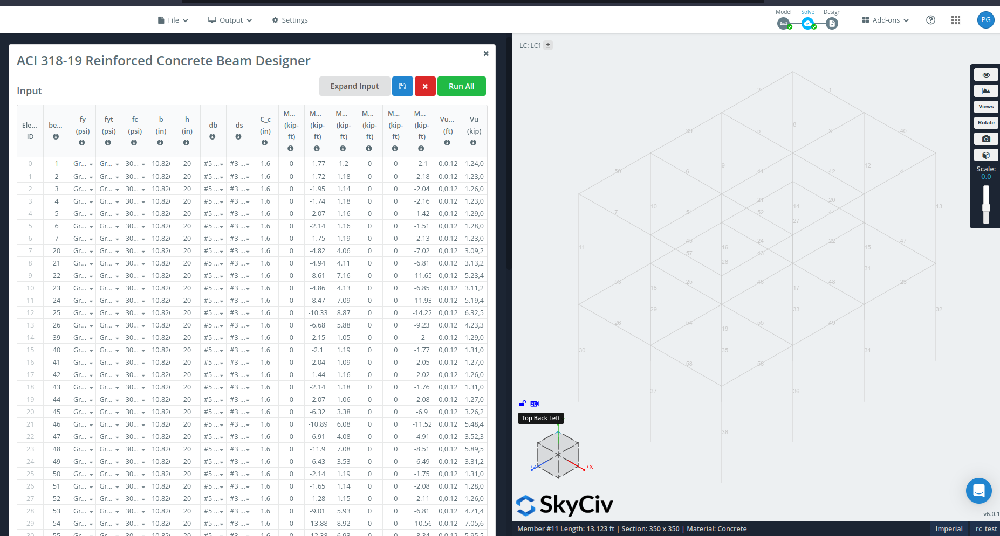

## Reinforced concrete_beam Designer as per ACI 318-19 (Imperial)

Calculate the required flexural and shear reinforcement for a rectangular beam and get the corresponding beam schedule in just few clicks!

## Assumptions:
### Flexure Reinforcements:
Calculating for the required no. of main reinforcement, the following assumptions were used:
- The RC beam is analyzed as a rectangular section;
- The required flexure reinforcment `As` is calculated with the assumption of 1 layer of rebars;
- Compression reinforcement are neglected in the calculation;
- A minimum of 2 rebars or 1/2 of the corresponding opposite side of each location shall always be provided, whichever is larger; and
- The effect of slab in the compression zone is neglected.

### Shear Reinforcements:
Calculating for the required spacing of shear reniforcement, the following assumptions were used:
- The spacing of stirrups was calculated using two (2) legs
- The maximum spacing, regardless if stirrups are required or not, will be minimum of d/2 or 24 in.
- Torsional effects are not considered.

## How to Use this Calculator

## Standalone

Step 1: Specify material strength (fy and fc), beam dimensions, reinforcement to be used, design moments, and design shear loads at the left menu

Step 2: For the shear loads - Vu location and Vu, this can be a single value, or use a comma-separated value for multiple locations

Step 3: Click Run button at the upper right part of the screen to generate the calculation report and the number of rebar to be installed for top, bottom bars of A-end, B-end, and midspan of the beam

## In S3D

Step 1: Load the module in the S3D. Edit/modify the parameters for each beam section

Step 2: Load the module in the S3D. Edit/modify the parameters for each beam section

Step 3: Click the Report button to view individual calculation report 

## References

Check [verification.xlsx](./verification.xlsx) file for comparison of the calculated values with the references.

## References

- Darwin, D., Dolan, C. W., & Nilson, A. H. (2016). Design of concrete structures (Vol. 2). New York, NY, USA:: McGraw-Hill Education.
- ACI Detailing Manual MNL-66 (2020)
- Wight, J. K., & MacGregor, J. G. (2016). Reinforced concrete. Pearson Education UK.

