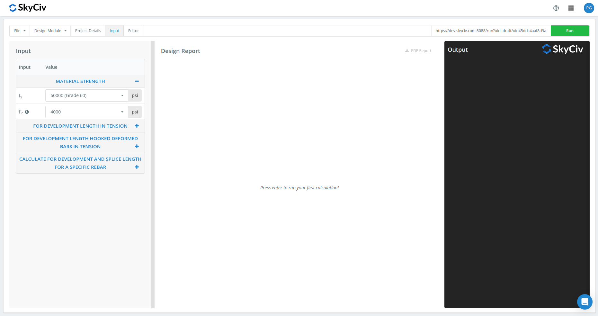
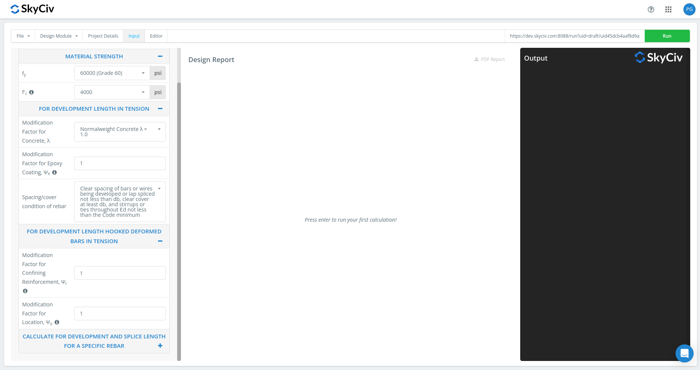
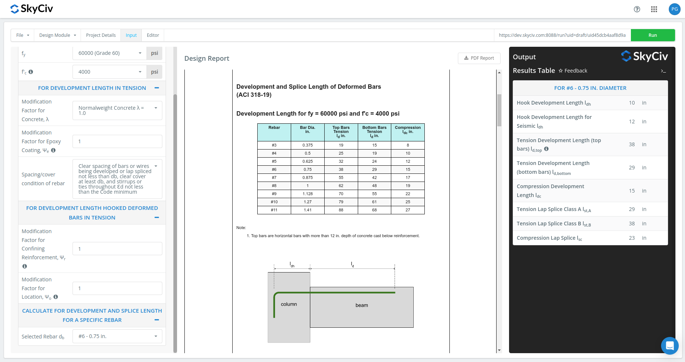
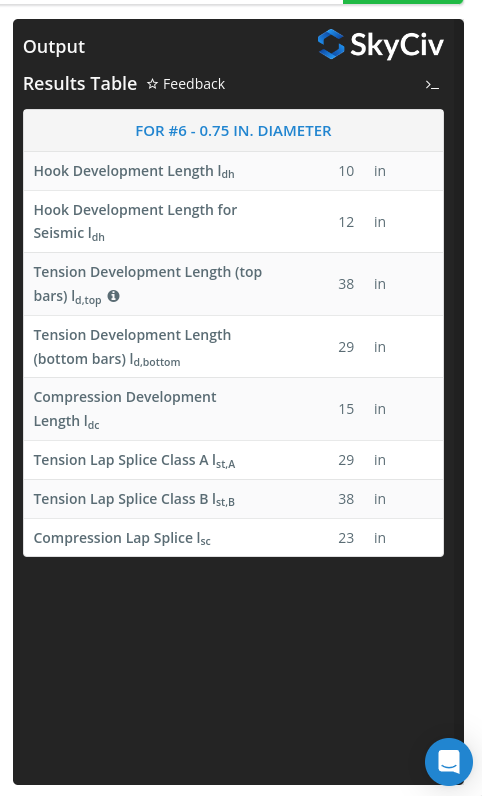

## Development and Splice Length Calculator for Deformed Bars as per ACI 318-19 (Imperial)

Calculate the development and splice length of deformed rebars for a rebar `fy` and concrete strength `f'c`. Generate detailed development and splice length calculation for a specific rebar diameter.

This tool is limited to imperial units only. Note that the calculator will calculate and round up the coefficient of each value that will be multiplied to the rebar diameter `db`. Moreover, upon multiplying the coefficient with `db`, the result will be then rounded up to the nearest whole number (in in.).

## How to Use this Calculator

Step 1: Specify material strength (fy and fc) at the left menu

Step 2: Specify modification factors - for calculating development length

Step 3: Specify the rebar that you want to get the detailed calculation of the splice and development length

Step 4: Click Run button at the upper right part of the screen. It will automatically generate a table of splice and development lengths specific for the fy and fc values for all the rebar diameters.

Step 5: It will print the output for the selected rebar at the right menu.

## Verification

Check verification.xlsx file for comparison of the calculated values with the references.

References used in verification:

- Darwin, D., Dolan, C. W., & Nilson, A. H. (2016). Design of concrete structures (Vol. 2). New York, NY, USA:: McGraw-Hill Education.
- ACI Detailing Manual MNL-66 (2020)
- Wight, J. K., & MacGregor, J. G. (2016). Reinforced concrete. Pearson Education UK.

